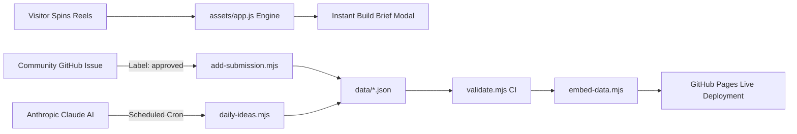

<div align="center">

# ⚡ Buildify

### The Autonomous Idea & Build-Brief Machine for Indie Hackers

[](https://rahil-den.github.io/buildify/)
[](LICENSE)
[](https://github.com/rahil-den/buildify/actions/workflows/deploy.yml)
[](https://developer.mozilla.org/)

<p align="center">
  <b>Never stare at a blank code editor again.</b><br>
  Buildify turns chaotic brainstorming into production-ready product briefs with interactive slot-machine reels, curated daily drops, and complete monetization roadmaps.
</p>

[Explore Startup Track](https://rahil-den.github.io/buildify/) •
[Explore CLI Track](https://rahil-den.github.io/buildify/cli.html) •
[Explore Web & Mobile Track](https://rahil-den.github.io/buildify/apps.html)

</div>

---

## 💡 What is Buildify?

Most idea generators give you vague one-liners like *"Uber for dog walkers"*. **Buildify does the heavy lifting.**

Every spin and daily feature synthesizes an actionable **Build Brief** designed to take you from concept to first customer:

- **🎯 The Pain Point:** Real friction experienced by a defined target market.
- **💸 Monetization & Pricing:** Who actually opens their wallet and how much they pay.
- **📋 Actionable MVP Checklist:** 3 to 6 pragmatic development milestones.
- **🚀 0-to-1 User Acquisition:** A battle-tested blueprint to land your first 10 paying users.
- **🛠️ Recommended Tech Stack:** Practical frameworks, databases, and APIs tailored to the scope.

---

## 🎰 Three Specialized Tracks

Buildify isn't one-size-fits-all. It provides three dedicated portals tailored to what you want to build:

| Portal | File | Reel Dimensions | Daily Spotlight | Focus |
|:---|:---|:---|:---|:---|
| 💼 **Startup Ideas** | [`index.html`](index.html) | `Business Model` × `Audience` × `Twist` | **Idea of the Day** | B2B Micro-SaaS, marketplaces, workflow tools |
| 💻 **CLI Projects** | [`cli.html`](cli.html) | `Terminal Tool` × `User Base` × `Twist` | **Project of the Day** | Developer tools, system utilities, Rust/Go CLIs |
| 📱 **Web & Mobile Apps** | [`apps.html`](apps.html) | `Core App` × `Audience` × `Twist` | **App of the Day** | Consumer apps, niche platforms, productivity |

---

## 🔥 Key Features

- **🎰 Physics-Driven Slot Machine:** Spin weighted mechanical reels with dynamic algorithmic grading (`Genius`, `Good`, `Mid`, `Bad`, `Cursed`).
- **📅 Rotating Daily Featured Picks:** A built-in catalog automatically rotates fresh daily picks even with zero setup or API keys.
- **🤖 Autonomous AI Pipeline:** Optional daily GitHub Actions workflow powered by Claude (`scripts/daily-ideas.mjs`) drafts, validates, tests, and auto-merges fresh daily picks every morning at 06:17 UTC.
- **👥 Seamless Community Contributions:** Users submit ideas or reel pieces through GitHub Issue forms. Adding the `approved` label automatically formats the JSON, schedules the release date, and redeploys the site.
- **⚡ 100% Vanilla & Instant:** Zero npm build step, zero bundling overhead, zero heavy frameworks. Pure modern JavaScript and CSS that runs at 60 FPS in any browser.
- **🛡️ Built-in CI Quality Gate:** `scripts/validate.mjs` verifies JSON schema correctness, detects near-duplicate pitches, and ensures clean data before every deployment.

---

## 📐 Architecture & Workflow



---

## 📁 Repository Structure

```
buildify/
├── index.html              # Startup ideas generator & daily spotlight
├── cli.html                # CLI utilities generator & daily spotlight
├── apps.html               # Web & mobile apps generator & daily spotlight
├── assets/
│   ├── site.css            # Dark/light styling, slot machine reels & responsive UI
│   └── app.js              # Reel animation physics, idea rotation & modal logic
├── data/
│   ├── ideas.json          # Startup ideas backlog, reel components & build briefs
│   ├── cli.json            # CLI tools backlog, reel components & build briefs
│   └── apps.json           # Web & mobile apps backlog, reel components & build briefs
├── scripts/
│   ├── validate.mjs        # Schema validator & similarity checker (runs in CI)
│   ├── embed-data.mjs      # Inlines data directly into HTML for offline portability
│   ├── daily-ideas.mjs     # AI pipeline for generating daily picks with Claude
│   └── add-submission.mjs  # Converts approved GitHub issues into scheduled entries
├── .github/
│   ├── workflows/          # GitHub Actions: deploy, AI cron & issue automation
│   └── ISSUE_TEMPLATE/     # Structured community contribution forms
├── LICENSE                 # MIT License
└── README.md               # Project documentation
```

---

## 🚀 Quickstart (Run Locally)

No Node.js compilation or complex installations needed!

### 1. Clone the repository
```bash
git clone https://github.com/rahil-den/buildify.git
cd buildify
```

### 2. Launch a local web server
Any static server works out of the box:

```bash
# Python 3
python3 -m http.server 8000

# Or Node.js
npx serve .
```

Open [http://localhost:8000](http://localhost:8000) in your browser.

> **Note:** You can also directly double-click `index.html` to preview the site, as offline data fallback is baked directly into the templates.

---

## 🌐 Deploy to GitHub Pages (Free)

Deploy your own live instance of Buildify in under two minutes:

1. Fork or push this repository to your GitHub account: `https://github.com/rahil-den/buildify.git`
2. In your repository, go to **Settings** → **Pages**.
3. Under **Build and deployment**, set **Source** to **GitHub Actions**.
4. Trigger the deployment:
   - Either make any commit to the `main` branch, or
   - Go to the **Actions** tab → **Deploy site** → click **Run workflow**.
5. Your site is live at:  
   `https://<your-username>.github.io/buildify/`

---

## 🤖 Configuring Automated Daily AI Picks (Optional)

To enable automatic daily updates curated by Claude:

1. Get an API key from [Anthropic Console](https://console.anthropic.com/).
2. In your GitHub repository:
   - Navigate to **Settings** → **Secrets and variables** → **Actions**.
   - Click **New repository secret**.
   - Name: `ANTHROPIC_API_KEY`
   - Value: *(Your Anthropic API key)*
3. The workflow runs every day at `06:17 UTC`. It writes tomorrow's entry, runs `validate.mjs`, commits the changes, and redeploys the site automatically.

---

## 🤝 Community Submissions Workflow

Buildify allows anyone to submit ideas directly from the site without touching code:

1. Create a label named `approved` in **Issues** → **Labels** → **New label**.
2. When a visitor submits an idea via the on-site forms, a GitHub issue is opened.
3. Review the submission. If it looks great, add the `approved` label.
4. The GitHub Action bot will:
   - Validate and normalize the suggestion.
   - Insert it into the correct `data/*.json` file.
   - Assign the next available calendar date.
   - Comment on the issue confirming publication and close it.

---

## 📜 License

Distributed under the **MIT License**. See [`LICENSE`](LICENSE) for complete details.

---

<div align="center">
  <b>Built for builders. Star ⭐ the repository if you found your next project idea here!</b>
</div>
